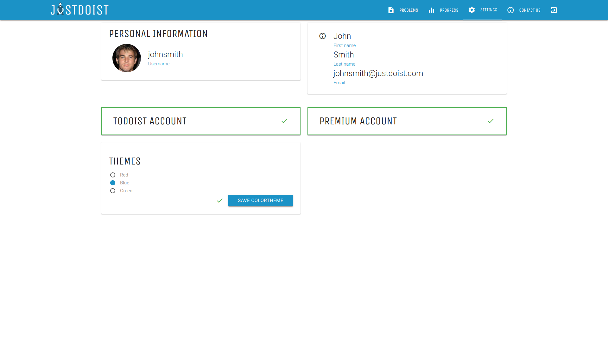

# JustDoist
## ToDoist add-on for ones, who just do it. https://justdoist.com/  
  
  

  
  
  
## Description
JustDoist is a webiste which analyzes your dailty ToDoist tasks and tries to find problems in your personal 
productivity. When it detects that there is a way you can boost your daily performance, it offers you a 
simple, step-by-step guide to do it. You can easily add your JustDoist tasks to ToDoist and track their completance, as 
well as your ToDoist karma.
  
  
## Features  
- Automatic problem detection  
- Step-by-step problem guides
- Add problems to ToDoist directly  
- Premium mode with different color schemes  
  
  
## Current known bugs and issues
- Problem solution steps are given in a random oreder  
- Not enought content (more problems and solutions are needed)  
- No username\password checks (minimum length, etc.)  
- Karma growth bar not working correctly
  
  
## To run JustDoist locally
1. Create virtualenv with python 3.6 (I'll use virtualenvwrapper)
```bash
mkvirtualenv justdoist --python=python3.6
```
2. Activate the environment
```bash
workon justdoist
```
3. Install requirements
```bash
pip install -r requirements.txt
```
4. Run dev server
```bash
python manage.py makemigrations main
python manage.py migrate
cd main && python fill_db.py && cd .. 
python manage.py runserver localhost:5000
```
5. Congrats! Now you can access the site on http://localhost:5000.


## Production mode 
1. Install Docker and Docker-compose (apt users probably [want](https://stackoverflow.com/questions/42139982/version-in-docker-compose-yml-is-unsupported-you-might-be-seeing-this-error) to install Docker-compose directly from github)
2. Run Docker-compose in the porject directory
```bash 
cd JustDoist
sudo docker-compose up
```
3. Server will be listening on localhost:8181.

Note: by default, only `justdoist.com` domain is allowed in the production mode. 
So you won't be able to access any page without adding `*` 
 to `ALLOWED_HOSTS` (that may cause an [XSS-attack](https://en.wikipedia.org/wiki/Cross-site_scripting))
 in `settings.py`.  
   
   
 ## License
 
